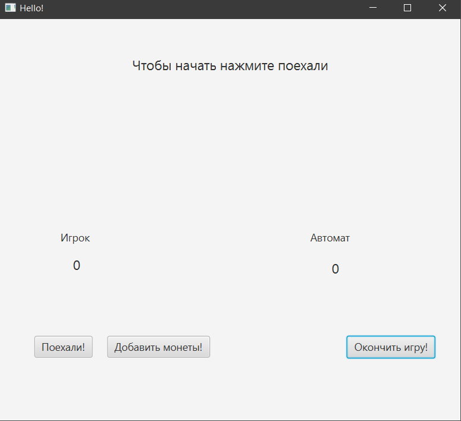
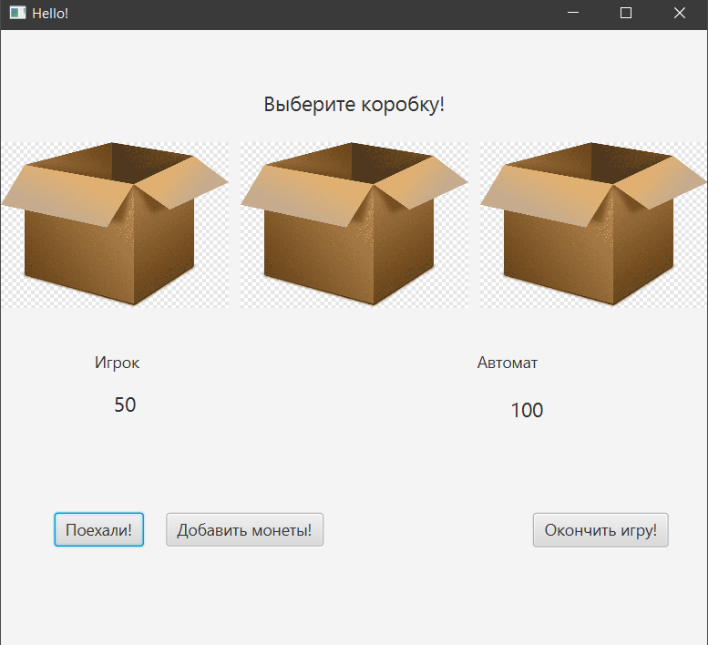
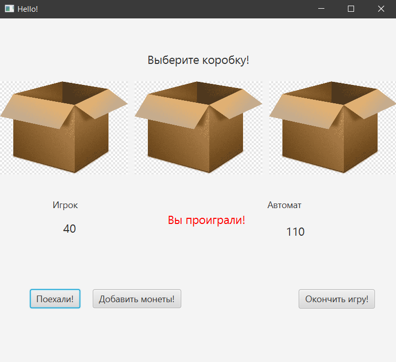
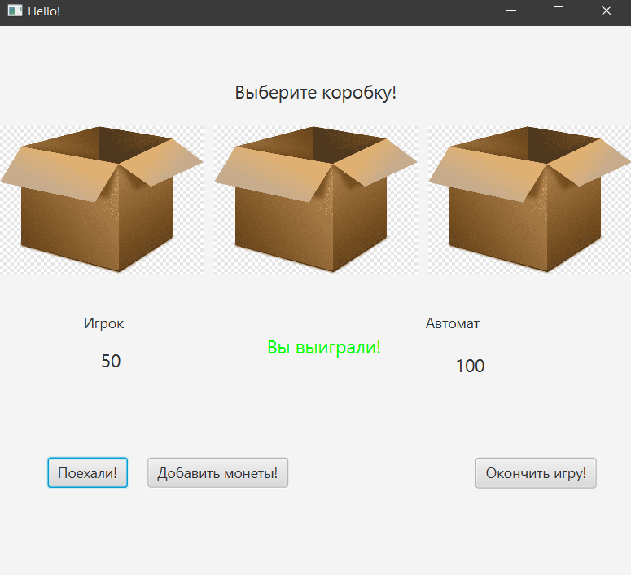
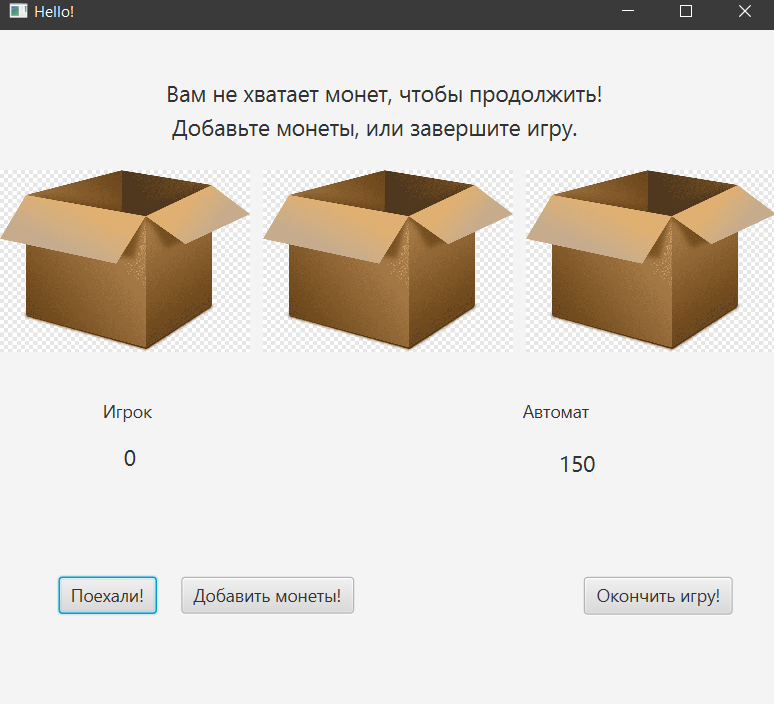

# Automat
В данном приложении используется паттерн "Цепочка обязанностей", 
чтобы создать цепочку объектов-обработчиков. Каждый объект в цепочке может обработать запрос 
или передать его следующему объекту в цикле. Обработчики: 
PositiveHandler, NegativeHandler и LossHandler. PositiveHandler обрабатывает выигрышные результаты, NegativeHandler обрабатывает проигрышные результаты, 
LossHandler обрабатывает ситуацию, когда у игрока или автомата не остается монет.
## Интерфейс программы
### Главное окно программы. 

### Начало игры. 

### Проигрыш. 

### Выигрыш. 

### Недостаточно монет. 

