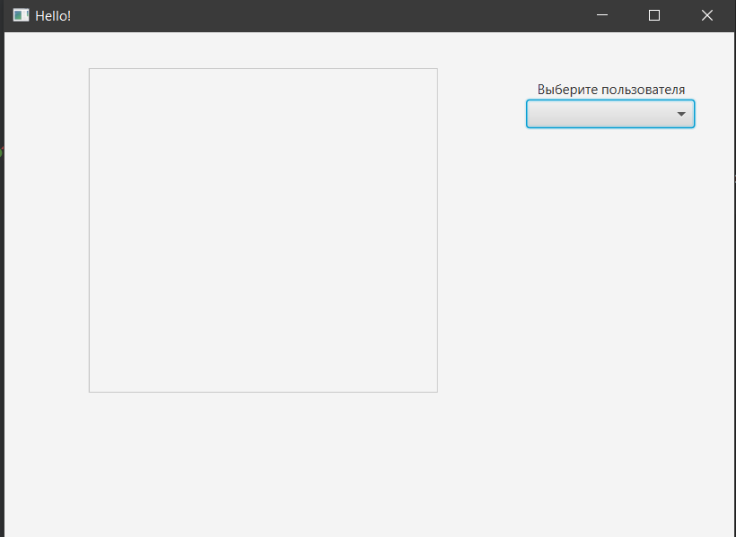
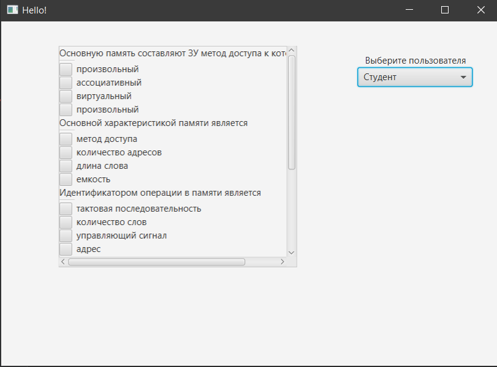
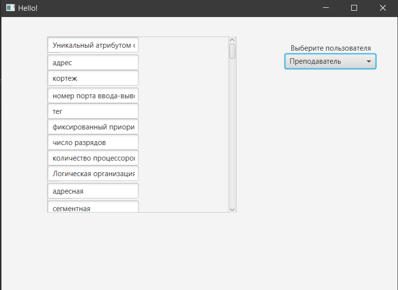
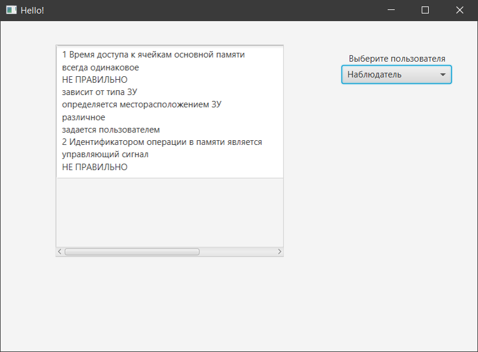

# TASK 11. ПОСРЕДНИК (Mediator)
Режим тестирования  (пользователь Студент) предполагает вывод вопроса и 1 правильного   и   3 неправильных ответов.
Режим редактирования (пользователь Преподаватель) предполагает вывод полей редактирования с вопросом и всеми правильными, а потом всеми неправильными ответами.
Режим чтения (пользователь Наблюдтель) предполагает вывод только для чтения. 
Для организации взаимодействия был использован паттерн Mediator. Посредник в зависимости от введенного логина запускает соответствующий режим
## Интерфейс программы
### Главное окно программы. 

### Пользователь Студент.

### Пользователь Преподаватель.

### Пользователь Наблюдатель.

