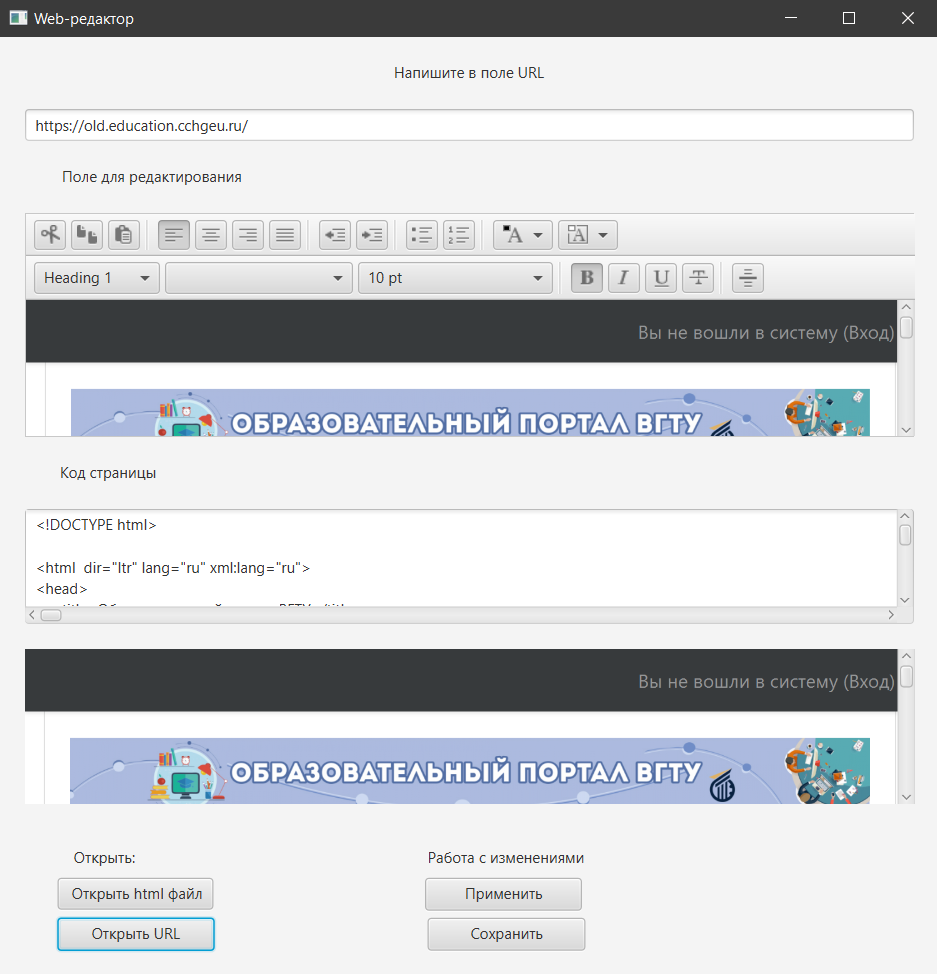

# Web-editor
## HTML-РЕДАКТОР
Редактор исходного кода веб-страниц, поддерживающих язык разметки
html, включает редактор исходного кода и средство предпросмотра вебстраниц.
## Интерфейс программы
### Главное окно программы. 

### Кнопка "Открыть html файл". 

### Кнопка "Применить". 

### Кнопка "Сохранить". 

### Кнопка "Открыть URL". 

